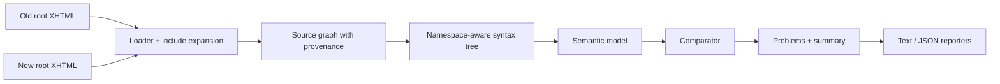

# Architecture Overview

## Purpose

This document describes the implementation boundaries used by the current codebase.

## Design Goal

The analyzer is designed to stay easy to trust, easy to test, and easy to extend for new tag semantics.

That means the core architecture should separate:

- physical source loading
- syntax parsing
- semantic extraction
- comparison
- reporting

## Data Flow

## Core Domain Objects

### Source Graph

Represents loaded files and include relationships before and during expansion.

It captures:

- root file
- included file path
- include call site
- include parameter set
- include stack
- cycle and missing-file errors

### Syntax Tree

Represents parsed XHTML with namespace-aware elements, explicit include-boundary nodes, and source metadata.

It captures:

- element name and namespace
- attributes
- child order
- source location
- logical include provenance

### Binding Model

Represents local variables introduced by Facelets and JSTL constructs and tracked through semantic extraction.

It captures:

- binding id
- written name
- binding kind
- source location
- parent scope
- symbolic origin

### Semantic Node

Represents behaviorally relevant facts extracted from syntax nodes.

It captures:

- semantic signature
- normalized EL expressions
- form ancestry
- naming-container ancestry
- iteration ancestry
- ids and target references
- transparency or matching hints

### Problem

Represents an actionable diagnostic rendered by the CLI and reporters.

It captures:

- severity
- category
- old and new locations
- snippets
- explanation
- remediation hint

## Recommended Module Boundaries

### `cli`

Owns argument parsing, result rendering selection, and process exit codes.

### `loader`

Owns path resolution, include expansion, provenance, cycle detection, and missing-file handling.

### `syntax`

Owns namespace-aware parsing and location-preserving tree construction, including expanded logical include nodes.

### `scope`

Owns binding stacks, scope transitions, and local-root resolution.

### `el`

Owns EL tokenization, parsing, and symbolic normalization.

The EL layer should accept only the MVP subset defined in [docs/el-grammar-subset.md](docs/el-grammar-subset.md). It must parse EL containers within literal templates, normalize supported expressions symbolically, and hand unsupported forms back to `semantic` and `compare` as explicit unknowns rather than partial best-effort matches.

### `semantic`

Owns extraction of bindings, normalized EL facts, semantic nodes, ancestry, and resolved target references from syntax trees.

### `compare`

Owns node matching, mismatch detection, duplicate suppression, sanity checks, and final result derivation.

### `report`

Owns text and JSON rendering, diagnostic explanation output, and stable ordering.

## Extension Strategy

Tag semantics are described in a registry rather than scattered across parser or comparator logic.

Each tag rule should be able to answer:

- does this tag introduce a binding?
- does it create a naming container?
- is it transparent for matching?
- which attributes contain EL?
- which attributes contain target references?

This keeps support for third-party component libraries incremental and testable.

The registry is layered:

- bundled defaults cover Facelets, JSTL, and core JSF semantics
- an optional execution-root `.xhtml-inline-check.json` can extend or override those defaults for project-specific schemas

## Matching Strategy

The comparator should prefer stable anchors over generic tree diffing.

Current order:

1. explicit ids
2. explicit target relationships
3. semantic signatures
4. unmatched-node diagnostics

This reduces diagnostic cascades and keeps output easier to understand.

## Operational Notes

- Loader and parser preserve enough metadata for file-linked diagnostics.
- The loader, syntax walker, and semantic handoff share one `TagRuleRegistry`; later changes should keep reading the same rule decisions instead of re-deriving semantics ad hoc.
- The EL layer stays symbolic; it is not a runtime evaluator.
- The semantic layer treats transparent wrappers carefully so include inlining does not create false mismatches.
- The comparator suppresses duplicate downstream noise when a single upstream mismatch already explains the failure.
