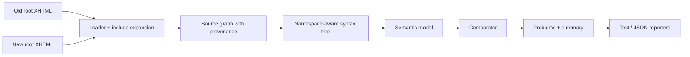

# Architecture Overview

## Purpose

This document translates the product specification into implementation-facing boundaries so the codebase can grow without mixing concerns too early.

## Design Goal

The analyzer should be easy to trust, easy to test, and easy to extend for new tag semantics.

That means the core architecture should separate:

- physical source loading
- syntax parsing
- semantic extraction
- comparison
- reporting

## Data Flow

## Core Domain Objects

### Source Graph

Represents files and include relationships before or during expansion.

Should capture:

- root file
- included file path
- include call site
- include parameter set
- include stack
- cycle and missing-file errors

### Syntax Tree

Represents parsed XHTML with namespace-aware elements and source metadata.

Should capture:

- element name and namespace
- resolved tag-rule semantics from the shared registry
- attributes
- child order
- source location
- logical include provenance

### Binding Model

Represents local variables introduced by Facelets and JSTL constructs.

Should capture:

- binding id
- written name
- binding kind
- source location
- parent scope
- symbolic origin

### Semantic Node

Represents behaviorally relevant facts extracted from syntax nodes.

Should capture:

- semantic signature
- normalized EL expressions
- form ancestry
- naming-container ancestry
- iteration ancestry
- ids and target references
- transparency or matching hints

### Problem

Represents an actionable diagnostic.

Should capture:

- severity
- category
- old and new locations
- snippets
- explanation
- remediation hint

## Recommended Module Boundaries

### `cli`

Owns argument parsing, result rendering selection, and process exit codes.

### `loader`

Owns path resolution, include expansion, provenance, cycle detection, and missing-file handling.

### `syntax`

Owns namespace-aware parsing and location-preserving tree construction.

### `scope`

Owns binding stacks, scope transitions, and local-root resolution.

### `el`

Owns EL tokenization, parsing, and symbolic normalization.

The EL layer should accept only the MVP subset defined in [docs/el-grammar-subset.md](docs/el-grammar-subset.md). It must parse EL containers within literal templates, normalize supported expressions symbolically, and hand unsupported forms back to `semantic` and `compare` as explicit unknowns rather than partial best-effort matches.

### `semantic`

Owns extraction of structural facts and normalized node facts from syntax trees.

### `compare`

Owns node matching, mismatch detection, duplicate suppression, and final result derivation.

### `report`

Owns text and JSON rendering and stable output ordering.

## Extension Strategy

Tag semantics should be described in a registry rather than scattered across parser or comparator logic.

Each tag rule should be able to answer:

- does this tag introduce a binding?
- does it create a naming container?
- is it transparent for matching?
- which attributes contain EL?
- which attributes contain target references?

This keeps support for third-party component libraries incremental and testable.

## Matching Strategy

The comparator should prefer stable anchors over generic tree diffing.

Recommended order:

1. explicit ids
2. explicit target relationships
3. semantic signatures
4. unmatched-node diagnostics

This reduces diagnostic cascades and keeps output easier to understand.

## Implementation Notes

- Loader and parser should preserve enough metadata for file-linked diagnostics from day one.
- The loader, syntax walker, and semantic handoff should share one `TagRuleRegistry`; resolve tag semantics once onto syntax nodes so later scope and structural work read the same rule decisions.
- The EL layer should stay symbolic; it is not a runtime evaluator.
- The semantic layer should treat transparent wrappers carefully so include inlining does not create false mismatches.
- The comparator should suppress duplicate downstream noise when a single upstream mismatch already explains the failure.
